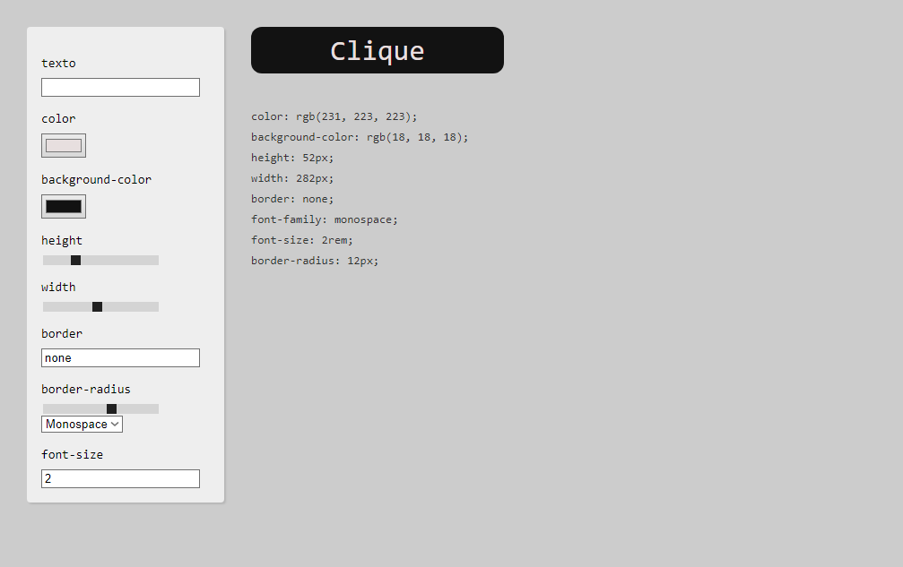

# button-creator

## 🎯 Objetivo

Projeto desenvolvido através do curso de Javacript da [Origamid](https://www.origamid.com/curso/javascript-completo-es6) com o objetivo de criar um gerador css para criação de buttons. Neste projeto aplicamos conceitos de
LocalStorage.

## 🛠️ Tecnologias utilizadas

Para o desenvolvimento deste site utilizei as seguintes tecnologias:

- HTML;
- CSS;
- JavaScript;
